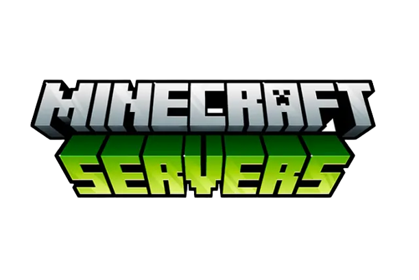

# Basic Minecraft Server
This github was created by HackDev, also known as HackTheAir.
This is a simple Minecraft server.

# How To Use
Start the server by opening Start.Bat.
 
When you run the bat file the server will start, it will open a log where you can op yourself with the /op PLAYERNAME command. 
Download Java: [Download Here | Click Here](https://www.oracle.com/java/technologies/downloads/)

# Updates
- Added 1.19.2
- Removed Herobrine

# Requirements
- A Windows 10 desktop or server.
- At least 4GB of RAM is recommended.
- A reliable wired network connection.
- A generous Internet bandwidth plan: Minecraft can use up to 100MB per player per hour, so an unlimited bandwidth plan is ideal.

